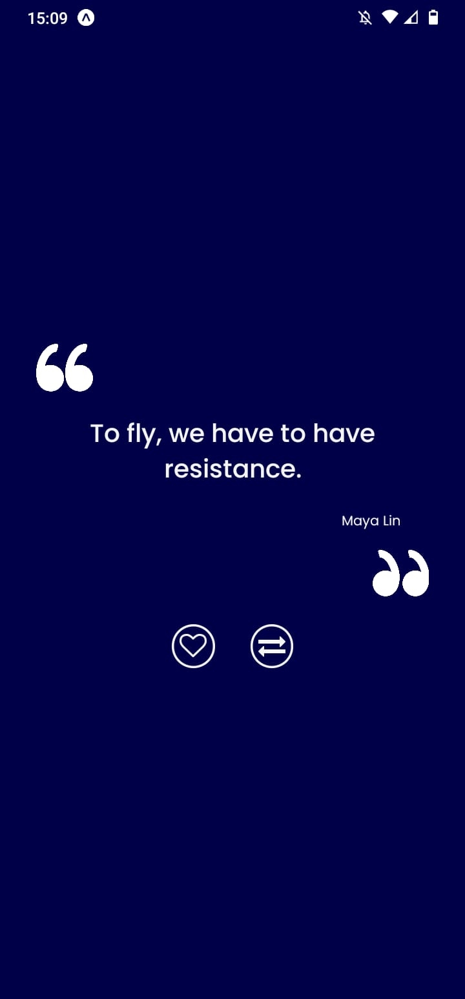

# **App Quote - Aplicativo de citações**

Desenvolvimento de um pequeno aplicativo, usando expo, com citações retiradas de uma api. 

A aplicação consiste, basicamente, em uma tela de login da conta via e-mail pessoal (Google ou Apple) e direcionamento para a Homepage com citações extraídas da API. A cada vez que o botão Gerar Citação for pressionado, uma nova citação é atualizada com os campos de texto e nome do autor extraídas da API.

## **O que aprendeu-se ao desenvolver essa simples aplicação:**

- Conceitos de componetização dos elementos da aplicação; ✅
- Estilização por meio da lib styled-components; ✅
- Tipagem estática em todo o desenvolvimento do projeto usando TypeScript; ✅
- Criação de rotas para navegação entre as páginas da aplicação usando CreateStackNavigation; ✅
- Criação de um contexto para autenticação no aplicativo por meio de Google Account; ✅
- Criação de hooks para o contexto de autenticação; ✅
- Usando ícones do expo por meio da lib expo vector-icons; ✅
- Otimização de desempenho dos botões usando a lib React Native Gesture handler. ✅

## **Observações importantes:**

- Todo o projeto foi desenvolvido no expo;
- O login por meio de e-mail pessoal ainda é uma tarefa em progresso. Entretanto, foi colocada uma rota entre as páginas para tornar a aplicação dinâmica ao testar inicialmente.

## **Links importantes:**

- Protótipo desenvolvido no FIGMA: https://figma.fun/6H0G7X
- Link da API utilizada: https://type.fit/api/quotes

## **Imagens da aplicação desenvolvida:**
 
<h1 align="center">
  
  
  
    
</h1>

## **Ajustes e melhorias**

O projeto ainda está em desenvolvimento e as próximas atualizações serão voltadas nas seguintes tarefas:

- [x] Ajustar botão de curtida da citação para operar com a função "dislike"
- [x] Integração de login social usando, de fato, Google e Apple Account

